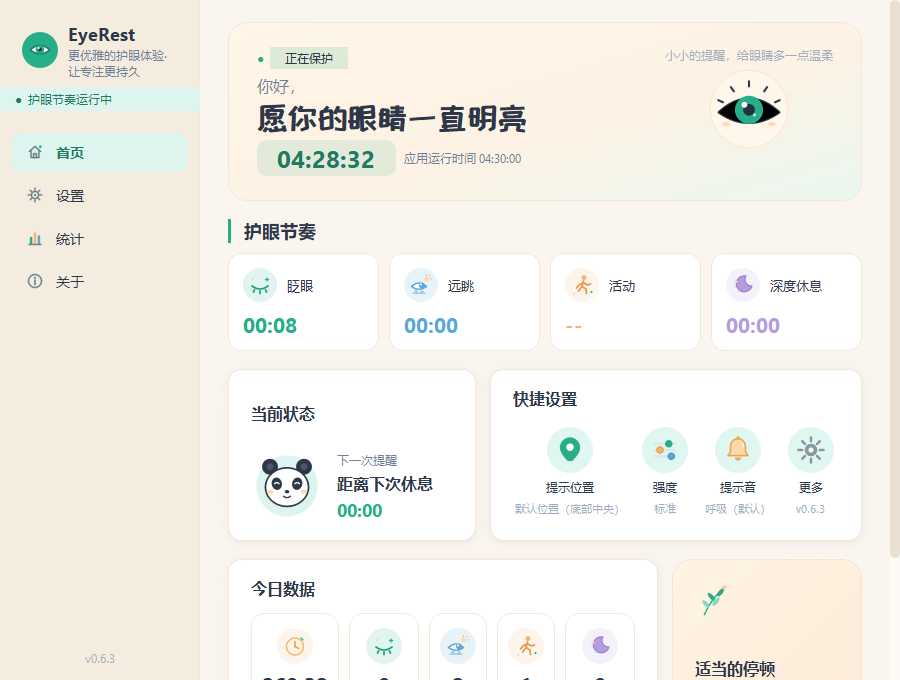
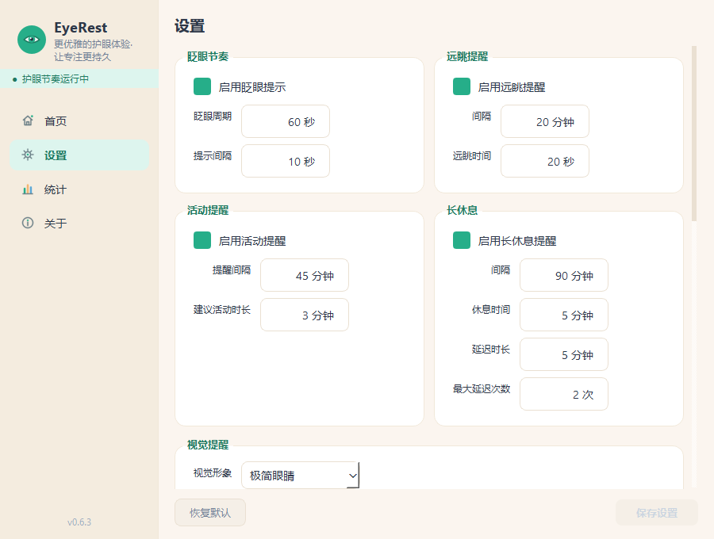
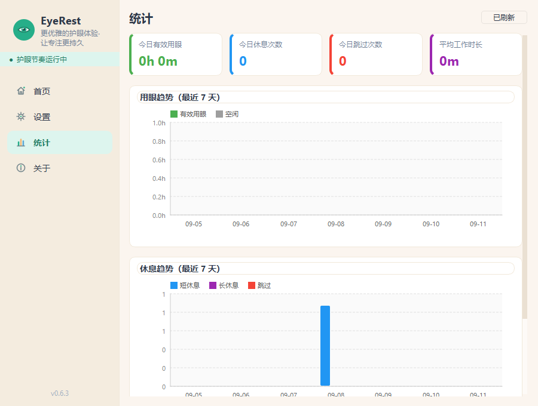
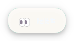

# EyeRest

**Windows 屏幕使用节奏管理器** —— 用低打扰的视觉提示，帮你管理「眨眼 / 远眺 / 起身活动 / 深度休息」四层用眼节奏。



## 这是什么

不是一个「定时弹窗提醒器」。两个关键区别：

**计时基准是屏幕暴露时间，不是键鼠活跃时间。** 屏幕亮着且未锁屏即算用眼——看 PDF、看视频、读代码时键鼠长时间不动，计时照常走，不会因为「你没敲键盘」而误判成休息。

**提示是低打扰的。** 默认不抢焦点、不遮内容，全屏时自动避让（推迟提醒与休息，不打断你正在做的事）。

## 四层节奏

| 层 | 默认节奏 | 做什么 |
| --- | --- | --- |
| **Blink** 眨眼 | 60s 一个周期，周期内每 10s 一次轻提示（共 5 次） | 文字提示与纯动画交替出现，避免视觉习惯化 |
| **Look Away** 远眺 | 每 20min | 提示看远处 20 秒（20-20-20 规则），非模态视觉提示，不再全屏打断 |
| **Move** 活动 | 每 45min | 提醒起身活动约 3 分钟 |
| **Deep Break** 深度休息 | 90min 周期 / 5min 全屏休息 | 独立记账，不受短休息重置影响；周期与时长均可自定义 |

各层周期与时长都可调（例如眨眼周期 30–180s、提示间隔 5–30s、长休 30–180min）。

**离开与休息的判定**：键鼠空闲 60–180s 进入「离开」状态（暂停累计、不重置）；超过 300s 判定为自然休息（重置会话）。

**数据诚实**：不开摄像头、不做生物识别。统计记录的是「提示触发次数」，不是「眨眼次数」——面板上写的就是它真正测到的东西。

## 界面

| 首页 | 设置 | 统计 |
| --- | --- | --- |
|  |  |  |

视觉提示卡（默认底部居中，可自由拖动到任意位置，带边缘保护）：



**视觉设置**：三种皮肤（极简眼睛 / 卡通双眼 / 小眼睛角色）、三档强度（安静 / 标准 / 明显）、位置（底部中央 + 四角预设 + 自由拖动）。

**托盘控制权**：暂停 30 分钟 / 2 小时 / 今天、游戏或会议模式、立即休息。日常可以完全藏在托盘里工作。

## 快速开始

要求 Windows 10/11、Python 3.12+。

```bash
cd apps/EyeRest
python -m venv .venv
.venv\Scripts\activate
pip install -r requirements.txt
python app/main.py
```

> 开发模式会把数据写到 `%APPDATA%\EyeRest\`（系统盘）。日常使用请打便携版，
> 或设 `EYEREST_DATA_DIR` 指向你想放数据的目录。

## 构建便携版

```bash
.venv\Scripts\python.exe tools\build_portable.py
```

一条命令完成：前置检查 → 备份用户数据 → 暂存构建 → **校验产物内的版本号与源码一致** → 启动冒烟 → `mv` 换位 → 还原数据 → 复查数据哈希与系统盘未被写。

产物在 `dist/EyeRest/`（`EyeRest.exe` + `_internal/` + `EyeRest-Portable.bat` + `data/`）。

> **不要直接跑 `pyinstaller EyeRest.spec --noconfirm`。**
> 它会**整个删掉** `dist/EyeRest/`，而便携版数据（`config.json`、`stats.json`、`logs/`、`sounds/`）
> 就在 `dist/EyeRest/data/` 里——等于连你的使用记录一起删。
> `EyeRest-Portable.bat` 也不在 spec 里，是手工产物，同样会丢。

日常运行：双击 `dist/EyeRest/EyeRest-Portable.bat`。它用 `%~dp0` 把临时目录也重定向到程序目录，
配合 **one-dir** 打包（无 `_MEI` 自解压过程），实现运行期零系统盘写入，整个目录可整体搬走。

## 数据目录

解析优先级（由高到低）：

1. 环境变量 `EYEREST_DATA_DIR` —— 显式指定
2. 打包模式（frozen）：exe 同级 `data/` —— 便携，不写系统盘
3. 开发模式：`%APPDATA%\EyeRest\`
4. 兜底：`~/.eyerest`

持久化是 `config.json`（只存与默认值的差异）+ `stats.json`，原子写入。无数据库、无 ORM。

## 设计系统

界面由一份 token 真源驱动：`app/ui/theme/tokens.py`。主色 `#26AE89`，暖奶油底 `#FBF5EF`，
默认字体、间距、圆角、阴影、动效时长都在这里定义；`components.py` 提供卡片、药丸按钮、
数字输入框等基础组件。

同一份 token 可导出为 **CSS 变量（`:root`）+ WXSS 变量（`page`）**，用于生成自包含的
HTML 设计板（`tools/build_design_board.py`），把「设计稿」和「真实实现」放在同一套数值上对账。
设计板与规格说明见 [`docs/design/`](docs/design/)。

## 项目结构

```
apps/EyeRest/
├── app/
│   ├── main.py              # 应用入口（事件装配与接线）
│   ├── core/                # 事件总线 + 屏幕暴露 / 眨眼 / 活动 / 休息 四引擎
│   ├── windows/             # Win32 平台检测：空闲 / 电源 / 会话 / 全屏 / 开机启动
│   ├── ui/                  # 主窗口、Dashboard、统计、设置、休息窗、托盘、视觉提示
│   │   └── theme/           # 设计系统：tokens（唯一真源）/ components / QSS / SVG 资源
│   ├── services/            # 业务服务 + JSON 存储
│   ├── config/              # 默认配置
│   ├── i18n/                # 中英文案
│   └── utils/               # 日志、时间、系统工具、音效合成
├── tests/                   # 单元测试
├── tools/                   # 构建与设计工具
├── docs/                    # 设计文档、规格、截图
├── assets/                  # 图标
├── EyeRest.spec
└── requirements.txt
```

### 工具（`tools/`）

| 工具 | 用途 |
| --- | --- |
| `build_portable.py` | 构建便携版（一条命令，全程校验，保住用户数据） |
| `build_design_board.py` | 由 token 生成自包含 HTML 设计板 |
| `export_css_tokens.py` | 把 token 导出为 CSS / WXSS 变量 |
| `shoot_board.py` | 设计板验收出图 |
| `render_theme_compare.py` | 主色方案并排渲染对比 |

## 技术栈

- **Python 3.12+**
- **PySide6（Qt 6）** —— 主窗口、系统托盘、全屏休息窗、无边框视觉提示、位置编辑器
- **ctypes / winreg 标准库** —— 空闲检测、电源事件、会话事件、全屏检测、开机启动，无需 pywin32
- **JSON 持久化** —— 无数据库、无 ORM

## 状态

**V0.6.3**

- 四层节奏全部落地，计时基准为屏幕暴露时间
- 设计系统 token 化，主色 `#26AE89`（暖色方案「轻奢艺术 · 温暖治愈」）
- 统一视觉提示组件：三种皮肤 / 三档强度 / 自由位置（真卡与位置编辑预览共用同一份样式）
- 全屏避让、空闲与自然休息判定、电源与会话感知
- 五套合成音效，与提示强度联动
- 测试基线：**567 passed + 3 subtests**

## 许可

尚未指定开源许可。
